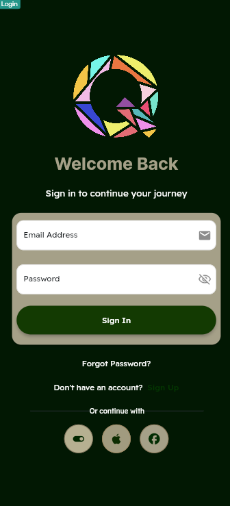

# **Quick**

O **Quick** é um aplicativo voltado para universitários que buscam uma maneira prática de realizar tarefas para outras pessoas, como lavar roupas, ajudar com trabalhos escolares ou outras atividades do dia a dia, e, com isso, ganhar um dinheiro extra. A ideia central do app é conectar estudantes que precisam de ajuda com tarefas simples, mas que demandam tempo ou esforço, a outros estudantes dispostos a realizar essas tarefas em troca de uma compensação financeira.

---

### **Funcionalidades principais**:

1. **Lavanderia e Serviços Domésticos**  
   Usuários podem contratar outros estudantes para realizar tarefas domésticas, como lavar e passar roupas, organizar espaços, entre outros.

2. **Tarefas Acadêmicas**  
   O app também pode ser usado para contratar estudantes que ajudem com tarefas acadêmicas, como resumos, pesquisas, revisão de textos ou até ajuda em projetos de grupo.

3. **Ganho de Dinheiro**  
   Os universitários que realizam as tarefas podem ganhar um dinheiro extra, o que é muito útil para aqueles que precisam de uma renda adicional durante o período de estudos.

4. **Avaliações e Feedback**  
   Assim como outros aplicativos de serviços, o Quick permite que os usuários avaliem quem contratou e quem prestou o serviço, o que ajuda a manter a qualidade e a confiabilidade dos serviços oferecidos.

5. **Facilidade de Uso**  
   O app é desenhado para ser simples e intuitivo, facilitando a interação entre os estudantes e tornando o processo de contratação e pagamento rápido e seguro.

---

### **Vantagens para os estudantes**:

- **Flexibilidade**:  
  Os universitários podem escolher as tarefas que querem fazer e ajustar o tempo de acordo com suas agendas.

- **Renda Extra**:  
  Uma maneira de complementar a renda, especialmente útil para quem vive de forma independente ou tem poucos recursos financeiros.

- **Rede de Apoio**:  
  Facilita o networking e a construção de uma comunidade de apoio entre os estudantes.

---

**Em resumo**, o Quick oferece uma solução prática para a realização de tarefas cotidianas e acadêmicas, criando um mercado de trabalho dentro do ambiente universitário, onde estudantes podem tanto ajudar quanto ser ajudados, com a vantagem de gerar uma renda extra no processo.

---

### **Ideias desde o início**:

  
  
  
  
  
  
  
  
  
  
  
  
  
  
  

